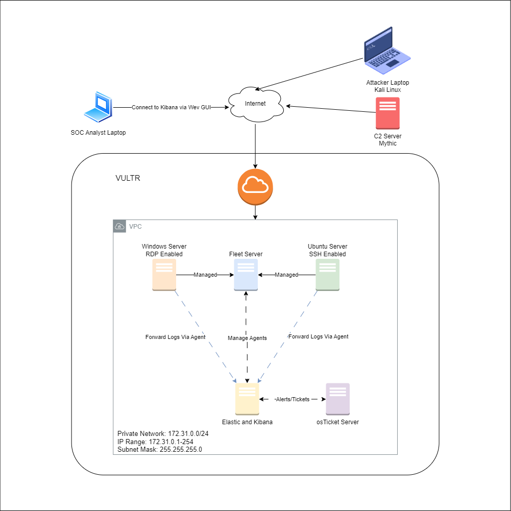

# 30 Day Challenge
A 30 day cybersecurity challenge to gain experience with the ELK stack, configuring and using a SIEM, and general blue team cyber knowledge!

To begin, we create a logical diagram that will outline where we are headed with this project and the architecture we intend to implement. The project will consist of 6 servers, 5 of which will be hosted via the cloud provider Vultr. 

